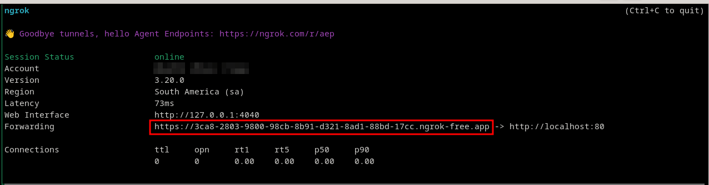

# Ngrok

Permite exponer tu local a internet, esto te permite prograr controladores que reciben llamadas desde internet por ejemplo.

[+info](https://ngrok.com/)

En la máquina HOST

## Install

```sh
curl -sSL https://ngrok-agent.s3.amazonaws.com/ngrok.asc | sudo tee /etc/apt/trusted.gpg.d/ngrok.asc >/dev/null \
&& echo "deb https://ngrok-agent.s3.amazonaws.com buster main" | sudo tee /etc/apt/sources.list.d/ngrok.list \
&& sudo apt update && sudo apt install ngrok
```

## usage

En tu máquina local

(Asumimos que la URL de tu máquina local es `saas.18.odoo.localhost` )

En la máquina HOST

```sh
ngrok http --host-header=saas.18.odoo.localhost 80
```

Esto va a arrancar el servicio de redirección y nos va a proveer de la URL externa que podemos usar para acceder a nuestro local.



Nota: si se accede desde un navegador web va a pedir confirmación, antes de redireccionarlo. Esto no pasa al acceder desde un cliente tipo curl o similar.

## Configurar URL en odoo

### system-parameters

```env
web.base.url =  https://3ca8-2803-9800-98cb-8b91-d321-8ad1-88bd-17cc.ngrok-free.app/
```
